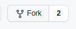

# React Workflow Cheatsheet

## 1. create your branch

<pre>

First create your branch for the code so the main code remains isolated from bugs you may cause while contributing, 
and once it seems to work fine we would merge your branchwith main. 
to create a branch go to the repository and go to fork button on top right menu 

> please name the branch with your name so its easy to track and manage

</pre>

## 2. edit the code

<pre>

`clone` the project in your system, 
make your changes, 
give your contributions, 
`commit` them, 
> make your commits, please write appropriate `messages` while commiting, be concise and objective
and then `push` them
> this one is the most important, dont't push to the main branch, switch branches beforehand

</pre>
