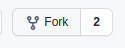

# ANDC-Alumni-Data
`This project aims to provide professional information of passed out students of Acharya Narendra Dev College, Delhi University in Graphic User Interface.`

## Frameworks

### Front-End

- React.js
- Bootstrap
- Material UI

### Back-End

- Python
- Django
- MongoDB
- PyMongo
- Rest API
- Google Forms API

### Database 

- Amazon Web Services

## Roadmap

- Designing Form
- Integrating Form to Database with Google form API
- Designing Home Page
- Setting up Back-End code
- Integrating Django and React

> Note : this roadmap is not chronological so you don't need to follow this order, moreover this order can change or we can do one or two things simultaneously

# `Cheatsheet`

## 1. create your branch

<pre>

First create your branch for the code so the main code remains isolated from bugs you may cause while contributing, 
and once it seems to work fine we would merge your branchwith main. 
to create a branch go to the repository and go to fork button on top right menu 

</pre>

> please name the branch with your name so its easy to track and manage

## 2. edit the code

<pre>

`clone` the project in your system, 
make your changes, 
give your contributions, 
`commit` them,
 
and then `push` them

</pre>

> make your commits, please write appropriate `messages` while commiting, be concise and objective. Most importantly, while pushing don't push to the main branch, switch to your branch, once you feel your code is free of errors and glitches and you've handeled all  borderline conditions, verify it with everyone else to merge

